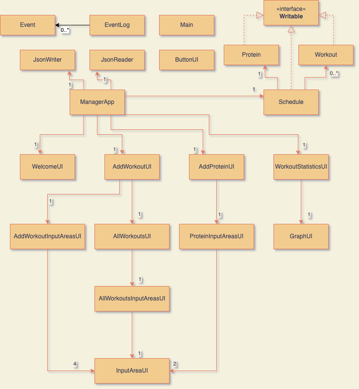

# Workout Manager

## Manage your workout menu, schedule, and protein recipe!

### Who will use this app?
This is the best app for those:
- who wants to work out **regularly**
- who wants to **get big** by constantly changing menus and increasing the load
- who has lots of **protein powders**, and can't make up their mind to choose which one to drink each day

### What this application does:
- *Manage your daily workout schedule*
- *You can add menus when you think you want to do more*
- *You can change the sets, reps, or rest period for each menu if you want*
- *Also you can schedule which type of protein you want to drink each day*

### Why is this project of interest to me?
*I recently started working out at the gym, and I personally found it difficult to manage the workout menu every day. 
Therefore, I thought this app might help me work out constantly.*

### User Stories 
- *As a user, I want to be able to add a workout menu to the daily workout schedule*
- *As a user, I want to be able to change the sets, reps, or rest*
- *As a user, I want to be able to change the remaining amount of protein powder when I consume it*
- *As a user, I want to be able to see the schedule information, including workouts and protein powder.*
- *As a user, I want to be able to set today's choice of protein powder*
- *As a user, I want to be able to know if my workout plan is too much work when adding or changing workouts.*
- *As a user, I want to be able to save my daily workout schedule.*
- *As a user, I want to be able to reload the entire schedule from the file when I log in.*
- *As a user, I want to be able to search a workout by name.*
- *As a user, I want to be able to add a workout menu to the daily workout schedule.*
- *As a user, I want to be able to search a workout by name.*

### UML Design Diagram

